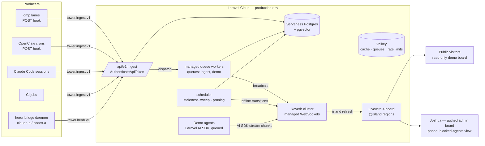
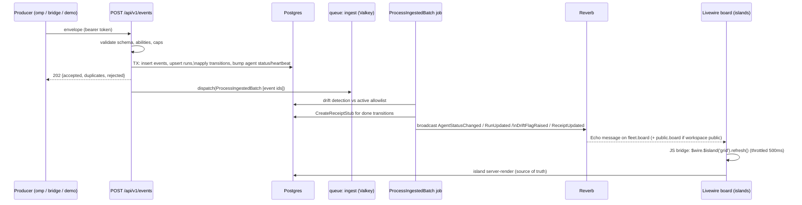

# Tower — Founding Architecture, Requirements & EDD Project Plan

**Repo:** `joshuaswarren/tower` (new) · **Date:** 2026-07-11 · **Window:** Sat 2026-07-11 08:00 → Sun 2026-07-12 submission
**Stack (fixed):** Laravel 13, Livewire 4 (Islands), Reverb, Pest, Laravel Cloud (Serverless Postgres + pgvector, Valkey, managed queues, scheduler). Single-tenant, open-source, no SaaS plumbing.
**Methodology:** Evidence-Driven Delivery per `local://edd-digest.md`. This document is the architect's technical doc — README/marketing prose is out of scope (voice-guard pipeline handles it separately).

---

> Founding document set, split from the 2026-07-11 architecture session. Cross-references: docs/ARCHITECTURE.md, docs/REQUIREMENTS.md, docs/delivery/PLAN.md.

# 1. ARCHITECTURE

## 1.1 System overview

Tower is one Laravel app with four surfaces: a token-authed **ingest API** (producers POST events), a **queue-backed processing layer** (drift detection, receipt stubs, broadcast fan-out), a **Reverb-pushed Livewire board** (islands re-render on push), and a **herdr bridge plugin** shipped inside the repo but running on the agent hosts.



**Design rule that keeps the weekend safe:** the ingest write path is synchronous and dumb (validate → insert → apply state transition → 202); everything that can lag (drift detection, receipt stubbing, broadcasting) runs on the `ingest` queue. The board never trusts pushed payloads for rendering — a Reverb message is only a *signal* to refresh a named island; the server render is the source of truth. If Reverb dies, `wire:poll.30s` fallback keeps the board honest.

## 1.2 Domain model

All IDs are ULIDs except `events.id` (bigint, append-only hot table). All timestamps `timestamptz`.

### `hosts`
| column | type | notes |
|---|---|---|
| id | ulid pk | |
| name | string unique | `claude-a`, `codex-a`, `cloud`, `github-actions` |
| kind | string enum-checked | `herdr` \| `server` \| `ci` \| `cloud` \| `other` |
| connect_hint | string nullable | copy-paste attach text: `ssh claude-a` / `herdr --remote claude-a` |
| last_seen_at | timestamptz nullable | bumped by any ingest from this host |

### `workspaces`
| column | type | notes |
|---|---|---|
| id | ulid pk | |
| host_id | fk nullable | herdr workspaces have hosts; logical workspaces (e.g. `acme`) may not |
| name | string | unique per host |
| visibility | string | `public` \| `private` — **the only sanitization switch.** Public board and `public.board` channel only ever see `public` workspaces. Default `private`. |

### `agents`
| column | type | notes |
|---|---|---|
| id | ulid pk | |
| workspace_id | fk | |
| host_id | fk nullable | denormalized for board grouping |
| name | string | `omp-lane-acme`, `herdr:claude-a:%3` |
| kind | string | `omp` \| `openclaw` \| `claude-code` \| `codex` \| `herdr` \| `ci` \| `demo` \| `other` |
| status | string | denormalized current state: `idle` \| `working` \| `blocked` \| `done` \| `offline` — maps 1:1 to herdr's 4 semantic states + derived `offline` |
| last_heartbeat_at | timestamptz nullable | |
| last_event_at | timestamptz nullable | |
| meta | jsonb | producer-supplied labels (pane id, lane name, model) |

**Invariants:** `status` is only written by `ApplyRunTransition` / heartbeat handler / staleness sweep — never by controllers directly. An agent with `last_heartbeat_at` older than `tower.staleness.offline_seconds` is swept to `offline` by the scheduler (never left green-stale — this is the whole reason Tower replaces HEARTBEAT.md age checks).

### `api_tokens`
| column | type | notes |
|---|---|---|
| id | ulid pk | |
| name | string | `omp-lane-acme token`, `herdr-bridge claude-a` |
| token_prefix | string(12) indexed | first 12 chars of plaintext, for O(1) lookup |
| token_hash | string(64) unique | SHA-256 of full plaintext token |
| owner_type / owner_id | morph nullable | `Agent` or `Host` (bridge tokens own a Host; pane-agents ride the host token) |
| abilities | jsonb | subset of `["ingest","ingest:herdr","attest"]` |
| last_used_at | timestamptz nullable | |

**ADR-0002 (token scheme):** Hand-rolled `api_tokens` table + `AuthenticateApiToken` middleware instead of Sanctum. Token format `twr_<base62 random 40>`; plaintext shown once by the minting CLI, only SHA-256 stored. Rationale: producers are not `users`; Sanctum couples tokens to user models and buys nothing here; the custom path is ~60 lines and fully testable. Rejected: Sanctum (user coupling), Passport (absurd overkill).

### `runs`
| column | type | notes |
|---|---|---|
| id | ulid pk | |
| agent_id | fk | |
| external_id | string | producer's run identity; **unique (agent_id, external_id)** |
| title | string nullable | |
| state | string | `queued` \| `running` \| `blocked` \| `done` \| `failed` \| `abandoned` |
| started_at / ended_at | timestamptz nullable | |
| duration_ms | bigint nullable | computed at terminal transition |
| exit_state | string nullable | producer-supplied (`success`, `error:timeout`, …) |
| meta | jsonb | |

**State machine (enforced in `App\Actions\Ingest\ApplyRunTransition`):** `queued→running`, `running↔blocked`, `running|blocked→done|failed|abandoned`. Terminal states are final. An out-of-order or illegal transition is **recorded as an event but rejected as a transition** (event row kept with `payload.transition_rejected=true`) — never silently reorder, never crash the batch.

### `events` (append-only, hot)
| column | type | notes |
|---|---|---|
| id | bigint identity pk | |
| agent_id | fk | |
| run_id | fk nullable | |
| type | string | `run.state_changed` \| `agent.heartbeat` \| `tool.invoked` \| `allowlist.declared` \| `allowlist.drift` \| `receipt.posted` \| `receipt.attested` \| `log.note` (`App\Enums\EventType`) |
| from_state / to_state | string nullable | for `run.state_changed` |
| payload | jsonb | ≤ `tower.ingest.max_payload_kb` |
| source | string | `api` \| `herdr-bridge` \| `demo` \| `system` |
| dedupe_key | string nullable **unique** | producer idempotency key; duplicate insert = counted, skipped |
| occurred_at | timestamptz | producer clock |
| received_at | timestamptz | server clock |

Indexes: `(agent_id, id desc)`, `(run_id)`, BRIN on `received_at`, unique partial on `dedupe_key where not null`.

**ADR-0003 (event table partitioning):** No partitioning this weekend. Single table + BRIN + scheduled `tower:prune-events` deleting rows older than `tower.retention.events_days` (default 30). Rationale: a personal fleet emits thousands of events/day, not millions; pg_partman on Serverless Postgres is untested risk on a deadline. Revisit if the table passes ~10M rows. Rejected: native declarative partitioning (migration complexity now for a problem we don't have yet).

### `receipts`
| column | type | notes |
|---|---|---|
| id | ulid pk | |
| run_id | fk | |
| agent_id | fk | denormalized |
| status | string | `unattested` \| `attested` |
| kind | string nullable | `link` \| `artifact` \| `text` |
| url | string nullable | the artifact link (PR, deploy, file) |
| summary | text nullable | |
| stub | jsonb | frozen at creation: `{agent, workspace, duration_ms, exit_state, done_at}` |
| attested_by_type / attested_by_id | morph nullable | `User` (admin UI) or `ApiToken` (attest-scoped) |
| attested_at | timestamptz nullable | |

**Honesty invariants (the settled model, decision 4):** (a) every `done` transition auto-creates exactly one `unattested` stub via `CreateReceiptStub` — no run finishes receipt-less; (b) `status` can only move `unattested→attested`, only via `AttestReceipt`, only by a `User` session or a token holding the `attest` ability, and attestation **requires** a non-empty `url` or `summary`; (c) attestation is immutable once set (corrections = new receipt, old one kept); (d) the board renders the two states unmistakably differently (dashed amber chip vs solid green chip). Tower never upgrades a receipt on its own.

### `allowlists`
| column | type | notes |
|---|---|---|
| id | ulid pk | |
| agent_id | fk | |
| version | int | monotonic per agent; **highest version = active** |
| manifest | jsonb | `{"tools": ["bash","edit","grep"], "scopes": ["repo:tower","net:api.anthropic.com"], "deny": ["prod:*"]}` — glob-matched strings |
| declared_at | timestamptz | |

### `drift_flags`
| column | type | notes |
|---|---|---|
| id | ulid pk | |
| agent_id / run_id / allowlist_id | fks (run nullable) | |
| tool | string | the invoked tool/scope that missed the manifest |
| detail | jsonb | matched event id, args summary (never raw secrets) |
| severity | string | `warn` \| `violation` |
| status | string | `open` \| `acknowledged` \| `resolved` |

**Invariant:** a drift flag is opened at most once per `(agent_id, tool, run_id)` — repeats increment `detail.count`, they don't spam the board.

### `users`
Stock Laravel table, registration disabled. One admin seeded from `TOWER_ADMIN_EMAIL` / `TOWER_ADMIN_PASSWORD` env (seeder refuses to run if unset in production). Session auth for `/board` and admin actions. No roles, no teams — single-tenant.

## 1.3 Ingest API contract

Base: `/api/v1`, `routes/api.php`. Auth: `Authorization: Bearer twr_…` → `App\Http\Middleware\AuthenticateApiToken` (constant-time hash compare after prefix lookup; sets the token principal on the request). Rate limit: `throttle:ingest` = `tower.ingest.rate_per_minute` (default 120) per token, backed by Valkey. Payload cap: `tower.ingest.max_payload_kb` (256) per event, `tower.ingest.max_batch_size` (100) events per POST. All responses JSON.

| Method + path | Controller | Ability | Purpose |
|---|---|---|---|
| `POST /api/v1/events` | `Api\V1\EventController@store` | `ingest` | Batch generic envelope (below) |
| `POST /api/v1/heartbeat` | `Api\V1\HeartbeatController@store` | `ingest` | Lightweight `{status?}` ping; bumps `last_heartbeat_at`, optional status |
| `POST /api/v1/allowlist` | `Api\V1\AllowlistController@store` | `ingest` | Declare/replace manifest → new `allowlists` version + `allowlist.declared` event |
| `POST /api/v1/receipts/{receipt}/attest` | `Api\V1\ReceiptController@attest` | `attest` | Attach artifact link to a stub |
| `POST /api/v1/herdr` | `Api\V1\HerdrIngestController@store` | `ingest:herdr` | herdr envelope (below); token must be Host-owned |
| `GET  /api/v1/ping` | closure | any | Auth smoke: `{ok:true, principal, abilities}` |

Token minting is CLI-only (no self-registration endpoint — token creation is a human act):
`php artisan tower:agent:create "omp-lane-acme" --workspace=acme --kind=omp --abilities=ingest,attest` and `php artisan tower:host:create claude-a --kind=herdr --connect-hint="ssh claude-a"` — each prints the plaintext token exactly once.

### Generic envelope — `tower.ingest.v1` (JSON Schema committed at `docs/contracts/tower.ingest.v1.json`)
```json
{
  "schema": "tower.ingest.v1",
  "sent_at": "2026-07-11T14:02:11Z",
  "events": [
    {
      "type": "run.state_changed",
      "run": {"external_id": "omp:acme:2026-07-11T13:55", "title": "ACME-241 checkout fix"},
      "from": "running",
      "to": "blocked",
      "occurred_at": "2026-07-11T14:02:09Z",
      "dedupe_key": "omp:acme:2026-07-11T13:55:evt-00042",
      "payload": {"reason": "awaiting approval", "tools_used": ["bash", "edit"]}
    },
    {"type": "agent.heartbeat", "occurred_at": "2026-07-11T14:02:10Z"}
  ]
}
```
Response `202 Accepted`: `{"accepted": 1, "duplicates": 1, "rejected": [{"index": 3, "error": "illegal transition done->running"}]}` — partial acceptance, never all-or-nothing (a producer must not lose 99 events because one was malformed). `401` bad token, `403` missing ability, `413` payload cap, `422` envelope-level schema failure, `429` throttle.

### herdr envelope — `tower.herdr.v1` (schema at `docs/contracts/tower.herdr.v1.json`)
POSTed by the bridge; `HerdrIngestController` translates to canonical events + upserts hosts/workspaces/pane-agents.
```json
{
  "schema": "tower.herdr.v1",
  "bridge_version": "0.1.0",
  "herdr_version": "0.4.2",
  "host": "claude-a",
  "tier": 0,
  "sent_at": "2026-07-12T09:15:04Z",
  "batch": [
    {"kind": "snapshot", "workspaces": [{"name": "tower", "panes": [{"pane": "%3", "agent_kind": "claude-code", "state": "working"}]}]},
    {"kind": "pane.agent_status_changed", "workspace": "tower", "pane": "%3", "agent_kind": "claude-code",
     "from": "working", "to": "blocked", "at": "2026-07-12T09:15:02Z", "dedupe_key": "claude-a:%3:8842"},
    {"kind": "pane.agent_detected", "workspace": "tower", "pane": "%5", "agent_kind": "codex", "at": "…", "dedupe_key": "…"},
    {"kind": "pane.closed", "workspace": "tower", "pane": "%3", "at": "…", "dedupe_key": "…"}
  ],
  "tails": [
    {"pane": "%3", "dedupe_key": "claude-a:%3:8842:tail", "content_redacted": "…last 40 lines, post-redaction…", "redactions_applied": 4}
  ]
}
```
Mapping: pane → `agents` row (name `herdr:<host>:<pane>`, kind from `agent_kind`, upsert keyed on host+workspace+pane in `meta.pane`); herdr states `blocked/working/done/idle` map 1:1 to `agents.status`; a `snapshot` batch item reconciles the full host (panes absent from snapshot → `offline`). `tails` are only accepted when `tier == 1` and are stored as `log.note` events (`payload.tail`, `payload.redactions_applied`) — the server additionally runs its own secret-shaped-pattern scan and rejects a tail that still looks secret-bearing (`rejected[].error = "tail failed server-side redaction screen"`). Defense in depth: redaction is the bridge's job; the server is the backstop.

## 1.4 Event flow (ingest → queue → Reverb → board)



**Channels** (`routes/channels.php`):
- `fleet.board` — private; auth: any logged-in user (single-tenant ⇒ the admin). Everything broadcasts here.
- `public.board` — public; only events whose workspace is `public` are re-broadcast here, with a slimmed payload (no `payload`, no receipt URLs for private runs — enforced in each event class's `broadcastWith()` + `broadcastOn()`).
- `demo.run.{runId}` — public; AI SDK stream chunks for a dispatched demo run.

**Broadcast event classes** (`App\Events\Board\…`, all `ShouldBroadcast`, queued on `ingest`): `AgentStatusChanged` (`broadcastAs: agent.status_changed`), `RunUpdated` (`run.updated`), `DriftFlagRaised` (`drift.raised`), `ReceiptUpdated` (`receipt.updated`), `DemoOutputStreamed` (`demo.chunk`, broadcast on `demo.run.{id}`, NOT queued — streamed inline from the demo job for latency).

**Board composition** (`App\Livewire\FleetBoard`, route `/` public variant + `/board` authed): named islands `@island(name: 'attention')` (blocked agents + open drift, always first, phone-optimized), `@island(name: 'grid')` (host → workspace → agent tree), `@island(name: 'feed', lazy: true)` (recent events, append mode), `@island(name: 'receipts', lazy: true)`. `resources/js/board.js` subscribes via Echo and calls `$wire.$island(name).refresh()` for the islands a message touches, throttled to 500ms per island.

**ADR-0004 (Islands vs polling):** Reverb push is the primary refresh trigger; every island also carries `wire:poll.30s` as degraded-mode fallback. Pushed payloads are never rendered client-side. Rationale: the board stays correct with Reverb completely down (poll), and stays cheap with Reverb up (islands re-render only what changed, no full-component payloads). Rejected: pure polling (kills the real-time judging story), client-side rendering from push payloads (two render paths = drift bugs on a deadline).

**ADR-0005 (queue topology):** Two named queues on the single Valkey connection: `ingest` (broadcast fan-out, drift, receipt stubs, staleness) and `demo` (AI SDK runs — slow, external-API-bound, must never starve board freshness). Both served by Laravel Cloud managed workers; `queue:work --queue=ingest` sized ahead of `demo`. Rejected: one default queue (a burst of demo runs would delay board updates), Horizon (Cloud managed workers already give visibility; Horizon adds a dashboard we don't need this weekend).

**ADR-0006 (scale-to-zero):** The production environment keeps compute always-on for the judging window (ingest 401/latency during cold starts would drop producer batches into their retry spools and make the "live" board stutter). Flex/scale-to-zero is the documented default for forks in `.env.example` comments. 

## 1.5 Allowlist drift detection

Producers declare a manifest once (or on change) via `POST /api/v1/allowlist`; each `tool.invoked` event (or `run.state_changed` carrying `payload.tools_used[]`) is checked by `App\Actions\Drift\DetectDrift` inside `ProcessIngestedBatch`: every invoked tool/scope string is matched against the active manifest's `tools` + `scopes` globs (`fnmatch` semantics); a `deny` match is severity `violation`, a plain miss is `warn`. Misses open a `drift_flags` row (deduped per agent+tool+run), write an `allowlist.drift` event, and broadcast `DriftFlagRaised` → the `attention` island. Agents with **no declared allowlist are not flagged** (drift is opt-in by declaring; config `tower.drift.enabled` global kill switch). Admin can `acknowledge`/`resolve` flags from the board (Livewire actions, session auth). This is the OpenClaw "permissions manifest" concept made visible: the board answers "which agent used a tool it never declared" at a glance.

## 1.6 herdr bridge plugin (`herdr-plugin/` in-repo)

Install: `herdr plugin install joshuaswarren/tower/herdr-plugin`. Contents:

```
herdr-plugin/
  plugin.toml            # name=tower, min_herdr_version pinned, entrypoint
  tower_bridge.py        # the single-file daemon (~250 lines, Python 3.11+, stdlib only)
  herdr_types.py         # GENERATED from `herdr api schema --json` — make regen-types, checked in
  config.example.toml    # tower_url, tower_token, host label, tiers, redaction patterns
  Makefile               # regen-types, lint, test
  tests/                 # pytest: envelope building, redaction, spool replay
```

Daemon behavior:
1. **Bootstrap:** `herdr api snapshot` → build `snapshot` batch item → POST (reconciles the board even after bridge downtime).
2. **Subscribe:** long-lived connection to `HERDR_SOCKET_PATH`, `events.subscribe` for `pane.agent_status_changed`, `pane.agent_detected`, pane/workspace lifecycle. Events buffered and flushed every 2s or 25 events, whichever first, as one `tower.herdr.v1` POST.
3. **Resilience:** POST failure → exponential backoff (1s→60s cap) and append batch to `HERDR_PLUGIN_STATE_DIR/spool.ndjson` (cap 5MB, oldest-dropped, drop counter reported in next successful envelope as `payload.spool_dropped`); on reconnect, spool replays before live traffic (dedupe keys make replay idempotent server-side). Socket loss → re-run bootstrap snapshot on reconnect.
4. **Telemetry tiers:** tier 0 (default): status transitions, agent kind, workspace/pane labels, timestamps, durations — **no PTY content, ever**. Tier 1 (opt-in per workspace in `config.toml [workspaces.<name>] tier = 1`): on a `done` transition, `pane.read` the last N lines, run the local redaction chain — built-in secret-shaped patterns (AWS keys, bearer tokens, `sk-…`, PEM blocks), every value currently present in the daemon's environment, then user `deny_regexes` from config — **before** anything leaves the box. Config in `HERDR_PLUGIN_CONFIG_DIR/config.toml`.
5. **No reverse channel.** The bridge never writes to herdr (no `send_keys`, no approvals). The board's attach affordance renders `hosts.connect_hint` as copyable text only. (Post-weekend feature; requires its own narrow allowlist + local confirmation design.)

**ADR-0007 (bridge language):** Python 3.11+ stdlib-only single file. Rationale: runs on the LXCs with zero dependency install, trivially auditable (~250 lines), matches the EDD tooling language already in Joshua's fleet. Rejected: Bun/TS (runtime install on hosts), PHP (no reason for the daemon to share the app runtime).

## 1.7 Demo agents (`App\Agents\…`, cut-safe by design)

Demo agents are **real registered agents** (kind `demo`, workspace `demo`/public, own tokens) that dogfood the ingest path — their runs, receipts, and events flow through `POST /api/v1/events` exactly like the real fleet. Visitors dispatch from the public board (`App\Livewire\DemoConsole`), rate-limited `tower.demo.rate_per_minute_per_ip` (3) via `RateLimiter` on Valkey, global cap `tower.demo.max_concurrent` (3); `RunDemoAgent` job on the `demo` queue drives the Laravel AI SDK with `stream()`, broadcasting chunks on `demo.run.{id}` and posting its own lifecycle events + a receipt (the fleet-health report itself, stored and linked — a demo run that produces an attested receipt demonstrates the whole honesty loop live).
1. **FleetAnalyst** (MUST if demo ships): reads the last 24h of board events, streams a fleet-health briefing (busiest agent, blocked time, drift summary). Pure personal-utility, judges watch real data get analyzed.
2. **ReceiptAuditor** (SHOULD): picks a `done` run, HEAD-checks its receipt URL resolves, streams an audit note, posts an attestation suggestion — shows the unattested→attested model on stage.
3. **AtcController** (SHOULD, whimsy): ATC-radio-styled fleet status transmissions ("Tower to omp-lane-acme, you are cleared for merge"). Ships only if it lands tonally — plain, not cheesy.
Kill switch: `TOWER_DEMO_ENABLED=false` removes the console and routes entirely (config `tower.demo.enabled`); cutting demo agents deletes `App\Agents\*` + `DemoConsole` + one route line — no tendrils.

## 1.8 Config surface (`config/tower.php`)

| Key | Env | Default |
|---|---|---|
| `tower.retention.events_days` | `TOWER_EVENTS_RETENTION_DAYS` | 30 |
| `tower.ingest.max_batch_size` | — | 100 |
| `tower.ingest.max_payload_kb` | — | 256 |
| `tower.ingest.rate_per_minute` | `TOWER_INGEST_RATE` | 120 |
| `tower.staleness.offline_seconds` | `TOWER_OFFLINE_AFTER` | 180 |
| `tower.drift.enabled` | `TOWER_DRIFT_ENABLED` | true |
| `tower.public_board.enabled` | `TOWER_PUBLIC_BOARD` | true |
| `tower.demo.enabled` | `TOWER_DEMO_ENABLED` | false |
| `tower.demo.max_concurrent` | — | 3 |
| `tower.demo.rate_per_minute_per_ip` | — | 3 |

Scheduler (`routes/console.php`): `tower:sweep-stale` every minute (heartbeat-based offline transitions + broadcast), `tower:prune-events` daily. Reverb config is Cloud-injected (`REVERB_APP_ID/KEY/SECRET/HOST`). pgvector is provisioned but **unused this weekend** (see WONT-4) — no forced semantic feature.

## 1.9 Key risks & mitigations

| # | Risk | Likelihood/Impact | Mitigation |
|---|---|---|---|
| R1 | Laravel Cloud + Reverb config friction eats Saturday | med / fatal | Walking skeleton with a proven Echo roundtrip is packet TWR-002, Saturday **morning**, before any feature code. Ship-risk dies first. |
| R2 | herdr API differs from expectations (new tool, unknown drift) | high / med | Pin `min_herdr_version`; generate `herdr_types.py` from `herdr api schema --json` Saturday; **fallback mode**: bridge polls `herdr api snapshot` every 15s if `events.subscribe` misbehaves (snapshot reconciliation already exists for bootstrap, so poll mode is free). herdr lane is fully parallel and cut-safe — Tower ships without it. |
| R3 | Demo agents flaky/expensive/abusable | med / low | Cut line is explicit (brief §6): if not solid by Sunday noon, `TOWER_DEMO_ENABLED=false`. Rate limits + concurrency cap + provider spend cap set before public exposure. |
| R4 | Scale-to-zero cold starts drop ingest during judging | med / med | ADR-0006: always-on compute through the weekend; producer hooks retry with spool anyway. |
| R5 | Public board leaks private fleet detail | low / high | Single sanitization switch (`workspaces.visibility`), enforced in `broadcastOn()` + board queries, covered by dedicated Pest tests (TWR-023) and a pre-submission manual sweep on the checklist. |
| R6 | Swarm lanes collide mid-Saturday | med / med | Contracts freeze packet (TWR-003) merges schemas/migrations/enums/channel names before lanes fan out; slug-in-branch-name convention; one lane = one worktree. |
| R7 | Out-of-order/duplicate producer events corrupt board state | med / med | Idempotency via `dedupe_key` unique index; state machine rejects illegal transitions while preserving the event record; snapshot reconciliation from herdr. |

---
