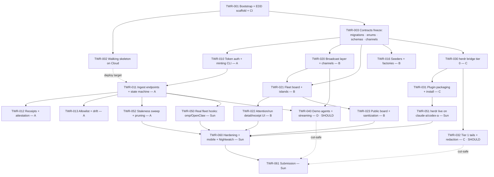

# Tower — Founding Architecture, Requirements & EDD Project Plan

**Repo:** `joshuaswarren/tower` (new) · **Date:** 2026-07-11 · **Window:** Sat 2026-07-11 08:00 → Sun 2026-07-12 submission
**Stack (fixed):** Laravel 13, Livewire 4 (Islands), Reverb, Pest, Laravel Cloud (Serverless Postgres + pgvector, Valkey, managed queues, scheduler). Single-tenant, open-source, no SaaS plumbing.
**Methodology:** Evidence-Driven Delivery per `local://edd-digest.md`. This document is the architect's technical doc — README/marketing prose is out of scope (voice-guard pipeline handles it separately).

---

> Founding document set, split from the 2026-07-11 architecture session. Cross-references: docs/ARCHITECTURE.md, docs/REQUIREMENTS.md, docs/delivery/PLAN.md.

# 3. PROJECT PLAN (EDD)

**Tracker:** Linear team `TWR`; every packet below gets a `TWR-###` issue before work starts (numbers below are the planned keys; if Linear assigns differently, the branch name carries truth — slug-in-branch-name per the recorded slug-in-branch refinement, no active-slug file). Packets live at `docs/delivery/work/TWR-###/packet.md` with `evidence/` and `prs/` per the EDD directory contract. One checklist item = one PR. Branch protection: `CI Complete` + required conversation resolution ON from TWR-001 onward.

**Swarm shape:** one human orchestrator (Joshua) + parallel agent sessions, one lane = one worktree = one packet at a time. Lanes: **S** (spine, serial, Saturday morning only), **A** (domain/API), **B** (board/realtime), **C** (herdr), **D** (demo agents). Cross-lane interfaces are frozen in TWR-003 (migrations, enums, JSON schemas, broadcast event names + channels) — after that, lanes only talk through those contracts; changes to a contract go back through a spine PR flagged to all lanes.

## 3.1 Dependency graph

**Parallelism:** after TWR-003 merges (target Sat ~10:30), lanes A, B, C run concurrently (3 agent sessions); D joins when TWR-020+011 merge (Sat afternoon, 4 concurrent). Sunday morning: TWR-050/051/052 in parallel, then serial hardening + submission.

## 3.2 Schedule & cut line

| Window | Spine / lanes |
|---|---|
| Sat 08:00–10:30 | S: TWR-001 → TWR-002 (deploy proof) ∥ TWR-003 drafted; contracts freeze merged |
| Sat 10:30–14:00 | A: 010→011 · B: 020, 016, 021 · C: 030 begins (against local, then Cloud) |
| Sat 14:00–19:00 | A: 012, 013 · B: 022, 023 · C: 030 finish, 031 · D: 040 begins |
| Sat 19:00–22:00 | D: 040 · C: 032 · A: 052 · integration smoke: real envelope from laptop → Cloud → board |
| Sun 08:00–12:00 | 050, 051 (real fleet live) · 052 wrap · 022/023 polish |
| **Sun 12:00 — CUT LINE** | Anything unmerged from {032, 040, FR-11, NFR-10/11 extras} is cut: config flag off or code absent, never stubbed. |
| Sun 12:00–submission | TWR-060 hardening, TWR-061 submission packet, tweet reply |

## 3.3 Work packets

Format per the context contract: **Target / Change / Acceptance**, plus lane, dependencies, and named evidence artifacts. Acceptance bullets are written to be falsifiable (Gherkin-grade concreteness); each maps to a Pest test or a recorded manual verification in the packet's `evidence/`. Every packet keeps a Working Log (done / next / blockers) current enough that another agent resumes it cold.

---

### TWR-001 — Repo bootstrap + EDD scaffold + CI  · Lane S · deps: none
**Target:** A pushable Laravel 13 repo with the delivery methodology structurally in force before any feature code.
**Change:** `laravel new tower` (Laravel 13, Pest preset); require `livewire/livewire:^4.0`, `laravel/reverb`, Laravel AI SDK; Pint config (max line 120). EDD scaffold: `docs/delivery/EVIDENCE-DRIVEN-DELIVERY.md` (canonical copy), `docs/delivery/work/000-packet-template.md`, 5 templates in `docs/delivery/templates/`, `scripts/delivery/{new_work_packet,pr_feedback_digest,verify_merge_ready,_utils}.py` (adapted from the canonical EDD scripts, slug-in-branch-name), `.claude/commands/{new-work,pr-feedback,merge-ready,review,deploy-staging,deploy-production}.md`, `.github/BUGBOT.md`, `.github/workflows/ci.yml` (hard: pint, pest, no-fakes grep gate `TODO: implement|Mockery::mock\(.*\)::class.*app/` on `app/ herdr-plugin/`; advisory-with-date: larastan L5, tightening 2026-07-19), synthetic `CI Complete` aggregator; branch protection: `CI Complete` required + required conversation resolution ON. `AGENTS.md` with binding workflow paragraph + environment map + commands. `docs/decisions/ADR-0001-adopt-edd.md` + ADR-0000 template. `progress.md`, `CHANGELOG.md`, `.env.example`.
**Acceptance:** Fresh clone: `composer install && php artisan test` green (example test). CI runs on a PR and `CI Complete` blocks merge when Pest fails (prove once with a deliberately red commit on a scratch branch). Branch protection screenshot shows required check + conversation resolution. `python3 scripts/delivery/new_work_packet.py --issue TWR-002 --title x` creates a valid packet dir.
**Evidence:** `docs/delivery/work/TWR-001/evidence/{ci-red-then-green.md, branch-protection.png, scaffold-tree.txt}`.

### TWR-002 — Walking skeleton on Laravel Cloud  · Lane S · deps: TWR-001
**Target:** The exact production topology serving at a `*.laravel.cloud` URL with a proven Reverb roundtrip — ship-risk dead by Saturday morning.
**Change:** Create Cloud app `tower`, production env on `main` auto-deploy: Serverless Postgres (pgvector enabled), Valkey, Reverb WebSocket cluster attached (Cloud injects `REVERB_*`), managed queue workers for `ingest` + `demo`, scheduler on. Health route `/up`. Placeholder page at `/` with a `SkeletonPing` broadcast event, an `@island` that re-renders on Echo message, and a `php artisan tower:ping` command that fires it. Set `TOWER_ADMIN_*`, provider API keys, always-on compute (ADR-0006).
**Acceptance:** `https://tower.laravel.cloud` (or assigned URL) returns 200. Running `tower:ping` in a Cloud command session updates the island in an open browser in <2s without reload (screen recording). Queued job round-trips (dispatch → worker log). Scheduler tick visible in logs. Deploy from push-to-main completes <5min.
**Evidence:** `TWR-002/evidence/{url.txt, reverb-roundtrip.mp4, deploy-activity.png, queue-worker-log.txt}`.

### TWR-003 — Contracts freeze  · Lane S · deps: TWR-001 (parallel with 002)
**Target:** Every cross-lane interface frozen so lanes A/B/C/D can run without talking: schema, enums, envelopes, channels, broadcast names.
**Change:** All migrations for §1.2 tables (hosts, workspaces, agents, api_tokens, runs, events, receipts, allowlists, drift_flags) with indexes exactly as specified; `App\Enums\{AgentStatus, RunState, EventType, ReceiptStatus, DriftSeverity, DriftStatus}`; Eloquent models with relationships + casts (no business logic); JSON Schemas `docs/contracts/tower.ingest.v1.json` + `docs/contracts/tower.herdr.v1.json`; `docs/contracts/channels.md` (channel names, broadcast event classes + `broadcastAs` strings + payload shapes); `config/tower.php` full key surface (§1.8). ADR-0002/0003/0004/0005/0006/0007 committed.
**Acceptance:** `php artisan migrate:fresh` clean on Postgres locally AND on Cloud. Both JSON schemas validate their example documents (schema-check Pest test using `justinrainbow/json-schema` or equiv). `channels.md` lists every name used anywhere later (verified at TWR-060 by grep). All 6 ADRs accepted.
**Evidence:** `TWR-003/evidence/{migrate-fresh-local.txt, migrate-fresh-cloud.txt, schema-validation-test.txt}`.

### TWR-010 — Token auth + provisioning CLI  · Lane A · deps: TWR-003
**Target:** Producers can be minted and authenticated; nothing else can touch `/api/v1`.
**Change:** `App\Http\Middleware\AuthenticateApiToken` (prefix lookup → constant-time hash compare → principal + abilities on request; bumps `last_used_at` throttled); ability check helper `EnsureTokenAbility`. Commands `tower:agent:create` and `tower:host:create` (create workspace/host rows as needed, print token once). `GET /api/v1/ping`. Rate limiter `ingest` registered against Valkey.
**Acceptance:** Pest: valid token → 200 ping with correct abilities; wrong token → 401; missing ability → 403; 121st request in a minute → 429. CLI creates agent + prints `twr_…` token exactly once; token absent from DB in plaintext (assert only hash stored).
**Evidence:** `TWR-010/evidence/{pest-auth.txt, mint-and-curl-cloud.md}` (curl against the deployed skeleton with a real minted token — searchable request IDs).

### TWR-011 — Ingest endpoints + run state machine  · Lane A · deps: TWR-010
**Target:** The core ingest path: batch envelope → durable events → correct run/agent state, idempotent, partially accepting.
**Change:** `Api\V1\EventController@store`, `HeartbeatController@store`, `Api\V1\Requests\StoreEventsRequest` (schema + caps validation); `App\Actions\Ingest\RecordEvents` (TX insert + dedupe), `App\Actions\Ingest\ApplyRunTransition` (state machine, §1.2 rules, illegal = record-but-reject), agent status/heartbeat denormalization; dispatch `App\Jobs\ProcessIngestedBatch` (drift + stubs + broadcast wired in later packets — job exists now, broadcasts `RunUpdated`/`AgentStatusChanged` from TWR-020 contracts).
**Acceptance (Pest, all concrete):** batch of 3 with 1 duplicate dedupe_key → `{accepted:2, duplicates:1}` and exactly 2 new event rows. `running→blocked` sets agent status `blocked` and run state `blocked`. `done→running` → rejected index in response, run stays `done`, event row exists with `payload.transition_rejected=true`. New `external_id` auto-creates run `queued/running` correctly. Batch of 101 → 422. Event payload >256KB → 413 with zero rows written. p95 <300ms over 50 sequential batch-25 POSTs locally (evidence note, not a CI perf test).
**Evidence:** `TWR-011/evidence/{pest-ingest.txt, cloud-ingest-smoke.md}` (real envelope curl → Cloud → row counts via `php artisan tinker` — counts asserted, not "it worked").

### TWR-012 — Receipts + attestation  · Lane A · deps: TWR-011
**Target:** The honesty model live: no run finishes receipt-less, no receipt attests itself.
**Change:** `App\Actions\Receipts\CreateReceiptStub` invoked from `ProcessIngestedBatch` on done transitions (stub jsonb frozen); `App\Actions\Receipts\AttestReceipt`; `Api\V1\ReceiptController@attest` (`attest` ability); Livewire admin attest action (session auth); `ReceiptUpdated` broadcast; `receipt.posted`/`receipt.attested` events written.
**Acceptance:** done transition → exactly one `unattested` receipt with correct duration_ms/exit_state in stub. Attest with `ingest`-only token → 403, receipt unchanged. Attest with URL via `attest` token → `attested`, immutable thereafter (second attest → 409). Duplicate done event (same dedupe_key) → still exactly one receipt.
**Evidence:** `TWR-012/evidence/{pest-receipts.txt, attest-flow-cloud.md}`.

### TWR-013 — Allowlist + drift detection  · Lane A · deps: TWR-011
**Target:** Declared-manifest drift visible on the board within seconds of the offending event.
**Change:** `Api\V1\AllowlistController@store` (versioned manifests); `App\Actions\Drift\DetectDrift` in `ProcessIngestedBatch` (glob match over `tool.invoked` + `payload.tools_used[]`; deny→violation, miss→warn; dedupe per agent+tool+run); `drift_flags` writes + `allowlist.drift` events + `DriftFlagRaised` broadcast; Livewire acknowledge/resolve actions (FR-11, cut-safe sub-item).
**Acceptance:** Agent with manifest `{tools:["bash","edit"]}` posting `tool.invoked: "curl"` → one open `warn` flag; posting it again in the same run → still one flag, `detail.count=2`. `deny:["prod:*"]` + scope `prod:db` → `violation`. Agent with NO manifest → zero flags for any tool. New manifest version supersedes: previously-drifting tool now declared → no new flags. `tower.drift.enabled=false` → detector no-ops.
**Evidence:** `TWR-013/evidence/{pest-drift.txt, drift-on-board.png}`.

### TWR-016 — Seeders + factories  · Lane B · deps: TWR-003
**Target:** A coherent demo workspace + realistic factories so board work and forks never depend on live producers.
**Change:** Factories for all models; `DemoWorkspaceSeeder` (public workspace `demo`, 2 hosts, 6 agents across states incl. one blocked + one open drift flag + attested and unattested receipts, 200 events over a fake 48h, clearly labeled DEMO); `AdminUserSeeder` (env-gated); `DatabaseSeeder` composes both.
**Acceptance:** `migrate:fresh --seed` yields a board (once TWR-021 lands) showing all 5 agent statuses, ≥1 drift flag, both receipt states; runs twice idempotently-fresh; refuses admin seed without env vars in production.
**Evidence:** `TWR-016/evidence/{seed-output.txt, seeded-board.png}` (screenshot added after 021).

### TWR-020 — Broadcast layer + channels  · Lane B · deps: TWR-003
**Target:** Every board-relevant mutation emits exactly the frozen channel contract.
**Change:** `routes/channels.php` (`fleet.board` private/user-authed, `public.board` public, `demo.run.{runId}` public); event classes `App\Events\Board\{AgentStatusChanged, RunUpdated, DriftFlagRaised, ReceiptUpdated, DemoOutputStreamed}` with `broadcastAs`/`broadcastOn`/`broadcastWith` per `docs/contracts/channels.md`, public-channel slimming for `public.board` (only public-workspace subjects, no payload/urls); Echo client setup in `resources/js/{echo.js, board.js}` with per-island throttled refresh.
**Acceptance:** Pest broadcast fakes: private-workspace `RunUpdated` broadcasts on `fleet.board` only; public-workspace on both, and the `public.board` payload contains no `payload` key. Browser: two windows (authed + public), event for private workspace updates only the authed one (manual evidence).
**Evidence:** `TWR-020/evidence/{pest-broadcast.txt, two-window-test.md}`.

### TWR-021 — Fleet board page + islands  · Lane B · deps: TWR-020, TWR-016
**Target:** The live board: topology, statuses, runs, feed — the thing judges look at.
**Change:** `App\Livewire\FleetBoard` at `/board` (auth) rendering islands: `attention` (eager), `grid` (eager, host→workspace→agent tree with status colors, active run titles, `connect_hint` copy affordance), `feed` (`@island(name:'feed', lazy: true)`, append mode for new events), `receipts` (lazy). `board.js` maps broadcast names → island refreshes. `wire:poll.30s` fallback on `grid` + `attention`. Login page (Fortify or stock auth scaffold, registration disabled).
**Acceptance:** Seeded board renders all statuses correctly at 1440px. Ingest POST (curl, laptop → Cloud) moves an agent working→blocked and the grid island updates <2s without reload (timed recording, ≥5 trials, note p95). Kill the websocket (devtools offline on ws) → board still correct within 35s via poll. Unauthed `/board` → redirected to login.
**Evidence:** `TWR-021/evidence/{latency-trials.md, board-1440.png, poll-fallback.md}`.

### TWR-022 — Attention surface + run detail + receipts UI  · Lane B · deps: TWR-021 (schema from 003; runs parallel to A-lane 012/013)
**Target:** Blocked-agents-on-phone (the killer feature) + receipts honesty rendered.
**Change:** `attention` island: blocked agents (with blocked-duration ticking) + open drift flags, sorted oldest-first, prominent at 375px; `App\Livewire\RunDetail` at `/runs/{run}` (event timeline, receipt chip, drift flags); receipt chips: dashed amber `UNATTESTED` vs solid green linked `ATTESTED` (tokens in `DESIGN.md`); drift ack/resolve buttons (admin).
**Acceptance:** At 375px the attention island is the first viewport content and lists a seeded blocked agent readably (screenshot). Attested receipt chip links out; unattested shows stub fields + no link. Run detail shows the full transition timeline for a seeded run in order.
**Evidence:** `TWR-022/evidence/{attention-375.png, run-detail.png, receipt-states.png}`.

### TWR-023 — Public board + sanitization  · Lane B · deps: TWR-021
**Target:** `/` is safe to put in a tweet: public workspaces only, read-only, no leakage.
**Change:** `FleetBoard` public mode at `/` (no auth, `tower.public_board.enabled` gate): queries filtered to `visibility='public'`, subscribes `public.board` only, no admin actions, demo console slot (filled by TWR-040 or absent). Pest: query-level filtering; channel-level filtering already covered in 020 — add belt-and-suspenders test that a private agent id never appears in public-mode rendered HTML.
**Acceptance:** With seeded private+public workspaces: `/` HTML contains zero private workspace/agent/run identifiers (automated assertion); `/board` shows both. Private-workspace event triggers no island refresh on `/` (manual two-window note). `TOWER_PUBLIC_BOARD=false` → `/` returns the login redirect.
**Evidence:** `TWR-023/evidence/{pest-sanitization.txt, public-vs-admin.png}`.

### TWR-030 — herdr bridge daemon, tier 0  · Lane C · deps: TWR-003 (POSTs to Cloud once TWR-011 deploys; develops against local first)
**Target:** herdr panes appear on Tower with 1:1 state mapping, resilient to network and daemon restarts.
**Change:** `herdr-plugin/tower_bridge.py` per §1.6: snapshot bootstrap, `events.subscribe` on `HERDR_SOCKET_PATH`, 2s/25-event batching into `tower.herdr.v1`, backoff + `spool.ndjson` (5MB cap + drop counter), snapshot-on-reconnect, poll-snapshot fallback mode (`--poll 15`); `herdr_types.py` generated via `make regen-types` from `herdr api schema --json`; `config.example.toml`; pytest suite (envelope building, spool replay, state mapping — herdr socket faked with recorded fixtures). Server side: `HerdrIngestController` translating batch items → upserts + canonical events (snapshot reconciliation: missing panes → offline).
**Acceptance:** pytest: recorded `pane.agent_status_changed` fixture → correct envelope with dedupe_key; kill network mid-run (fixture) → events spool and replay in order with zero server-side duplicates (dedupe assertion). Pest: herdr envelope creates host/workspace/agent rows, `blocked` pane → agent `blocked`; snapshot missing a known pane → that agent `offline`. Live: bridge against a real herdr session on the dev box shows a pane status flip on the local board <3s.
**Evidence:** `TWR-030/evidence/{pytest.txt, pest-herdr-ingest.txt, live-pane-flip.mp4}`.

### TWR-031 — Plugin packaging + install path  · Lane C · deps: TWR-030
**Target:** `herdr plugin install joshuaswarren/tower/herdr-plugin` works on a clean host.
**Change:** `herdr-plugin/herdr-plugin.toml` (name, entrypoint, pinned `min_herdr_version`); config bootstrap on first run (writes `HERDR_PLUGIN_CONFIG_DIR/config.toml` from example, prompts nothing — fails with a clear message listing required keys); maintainer doc `herdr-plugin/README.md` (install, config keys, tiers, fallback mode — technical, not marketing).
**Acceptance:** On a host without the repo: install command → daemon starts under herdr, refuses cleanly without `tower_url`/`tower_token` (exact error text asserted in pytest), connects after config. Version below `min_herdr_version` → refusal with message.
**Evidence:** `TWR-031/evidence/{clean-install.md}` (transcript from claude-a or a scratch LXC, commands + outputs).

### TWR-032 — Tier 1 tails + local redaction  · Lane C · deps: TWR-030 · **SHOULD (cut-safe)**
**Target:** Opt-in done-transition tails that provably cannot leak secrets.
**Change:** Bridge: per-workspace `tier=1` config; on done transition `pane.read` last N lines → redaction chain (built-in secret patterns, live env values, user deny_regexes) → `tails[]` in envelope. Server: accept tails only when `tier==1`, store as `log.note` events, server-side secret screen rejects suspicious tails; RunDetail renders tail block.
**Acceptance:** pytest: tail containing an actual env var value from the daemon's environment → value absent from the outbound payload (asserted byte-level); `sk-…`/PEM fixtures redacted. Pest: tier-0 envelope with tails → tails rejected; secret-looking tail → rejected with named error. Board shows a redacted tail on a real tier-1 done run.
**Evidence:** `TWR-032/evidence/{redaction-pytest.txt, tail-on-board.png}`.

### TWR-040 — Demo agents + streaming  · Lane D · deps: TWR-020, TWR-011 · **SHOULD (cut-safe; cut decision Sun 12:00)**
**Target:** Visitors dispatch a real AI agent and watch it stream + leave a receipt — the whole loop on stage.
**Change:** `App\Agents\FleetAnalyst` (+ `ReceiptAuditor`, `AtcController` if time); `App\Jobs\RunDemoAgent` on `demo` queue: registers run via internal ingest path (demo agents hold real tokens from the seeder), AI SDK `stream()` → `DemoOutputStreamed` chunks on `demo.run.{id}`, terminal transition + receipt (report stored at `/runs/{run}` and attested by the job's `attest`-ability token — a *legitimately* attested artifact, the report itself). `App\Livewire\DemoConsole` on `/`: dispatch button + live stream pane; `RateLimiter::for('demo-dispatch')` 3/min/IP; global `tower.demo.max_concurrent` gate (Valkey lock); provider spend cap set at the account level before enabling.
**Acceptance:** Dispatch from an incognito window → chunks stream into the console <5s from job start; run appears on the board `working→done`; receipt attested with a resolvable URL. 4th dispatch in a minute from one IP → friendly 429 message. With 3 running, a new dispatch queues (message says so) rather than exceeding the cap. `TOWER_DEMO_ENABLED=false` → console absent, routes 404.
**Evidence:** `TWR-040/evidence/{demo-stream.mp4, rate-limit.png, receipt-attested.png}`.

### TWR-050 — Real fleet wiring: omp + OpenClaw hooks  · Sun AM · deps: TWR-011 deployed
**Target:** Joshua's actual lanes and crons on the production board — the judging substance.
**Change:** (Outside tower repo, evidence captured inside it.) omp lane heartbeat path: POST hook (curl in the existing heartbeat script) emitting `tower.ingest.v1` heartbeats + run transitions with dedupe keys; OpenClaw cron wrapper likewise; allowlist declarations for both from their existing permissions manifests; tokens minted per producer (named, least-ability). Retry-with-spool in the hook (3 retries then append to a local spool file replayed next tick — mirrors bridge semantics, ~20 lines of bash).
**Acceptance:** Board shows ≥2 real non-herdr producers with live heartbeats and ≥1 real run transition each; killing a producer flips it to `offline` within 4 minutes (staleness sweep proof); a real blocked state surfaces in the attention island.
**Evidence:** `TWR-050/evidence/{producer-hooks.md (scripts + token names, secrets redacted), real-fleet-board.png, offline-sweep.md}`.

### TWR-051 — herdr live on claude-a / codex-a  · Sun AM · deps: TWR-031
**Target:** Real multi-box herdr herd visible: host → workspace → pane, blocked panes surfacing on the phone.
**Change:** Install plugin on both LXCs, mint host tokens, config with host labels + `connect_hint`s; tier 0 everywhere (tier 1 on at most one non-sensitive workspace if TWR-032 shipped).
**Acceptance:** Both hosts on the board with live pane-agents; blocking a real pane (agent waiting on approval) surfaces in `attention` <5s; bridge restart on claude-a reconciles without duplicate agents (row count before/after asserted via tinker).
**Evidence:** `TWR-051/evidence/{two-hosts-board.png, blocked-pane-phone.png, restart-reconcile.md}`.

### TWR-052 — Staleness sweep + retention + ops  · Lane A · deps: TWR-011
**Target:** The board never lies green and the events table never grows unbounded.
**Change:** `tower:sweep-stale` (every minute via scheduler: heartbeat older than `tower.staleness.offline_seconds` → `offline` + `AgentStatusChanged`); `tower:prune-events` (daily, respects `tower.retention.events_days`, chunked deletes); both registered in `routes/console.php`; Cloud scheduler verified.
**Acceptance:** Pest with time travel: agent silent 181s → swept `offline`, broadcast fired; heartbeat resumes → back to reported status. Prune deletes only rows older than cutoff (boundary row asserted kept). Cloud: scheduler run log shows both commands executing.
**Evidence:** `TWR-052/evidence/{pest-sweep-prune.txt, cloud-scheduler-log.png}`.

### TWR-060 — Hardening, mobile polish, Nightwatch  · Sun PM · deps: 022, 023, 050, 051, 052
**Target:** The deployed instance survives judging: correct on a phone, monitored, contract-clean.
**Change:** Responsive pass 375/768/1024/1440 on `/` and `/board`; grep-verify every channel/broadcast name against `docs/contracts/channels.md`; Nightwatch env keys on production (NFR-10); final no-fakes grep gate run; log scan on Cloud for recurring errors (allowlist-or-fix, each allowlist entry commented with an issue key); `progress.md` + `CHANGELOG.md` current with real dates.
**Acceptance:** Four-breakpoint screenshots of both boards, no horizontal overflow; Nightwatch dashboard shows production traffic; zero unexplained recurring log errors; `rg -n "TODO: implement|fake|stub" app/ herdr-plugin/` output empty or dispositioned in evidence.
**Evidence:** `TWR-060/evidence/{breakpoints/*.png, nightwatch.png, log-scan.md, no-fakes-grep.txt}`.

### TWR-061 — Submission  · Sun PM · deps: TWR-060
**Target:** The contest entry posted with receipts, before the deadline.
**Change:** Run the Sunday submission checklist (§3.5) top to bottom; capture the board screenshot with the real fleet live; post the tweet reply with the `*.laravel.cloud` URL + screenshot. (README prose goes through voice-guard separately — not this packet's scope; this packet only verifies a README *exists* and is technically accurate.)
**Acceptance:** Every checklist row checked with evidence linked; tweet posted (URL recorded); Definition of Shippable gates 1–7 all pass.
**Evidence:** `TWR-061/evidence/{submission-checklist.md, tweet-url.txt, board-final.png}`.

## 3.4 Definition of Shippable — Tower weekend edition

Applied Sunday before the tweet. Blockers must all pass; a HOLD names the single blocking fix.

| # | Gate | Blocker? | Proof required |
|---|---|---|---|
| 1 | **Live URL** — `*.laravel.cloud` serves `/` and `/board`, TLS, deploys from `main` | yes | URL + deploy activity ID |
| 2 | **Real data** — ≥2 real hosts and ≥3 real producers posting; demo workspace clearly labeled DEMO; nothing seeded presented as real | yes | `real-fleet-board.png` + producer token names |
| 3 | **Realtime** — event→pixel p95 <2s over ≥20 events with Reverb up; poll fallback verified once | yes | `latency-trials.md` |
| 4 | **Honesty model** — done runs carry stubs; ≥1 legitimately attested receipt visible; states visually distinct | yes | `receipt-states.png` |
| 5 | **No fakes** — grep gate empty on `app/` + `herdr-plugin/`; every cut feature absent or config-flagged off, never stubbed; cuts listed in `progress.md` | yes | `no-fakes-grep.txt` + cut list |
| 6 | **Evidence discipline** — every merged PR maps to a packet with Working Log + evidence; `verify_merge_ready.py` passed on every merge (break-glass ≤1, with written rationale) | yes | evidence-review pass over `docs/delivery/work/` |
| 7 | **Sanitization** — public board leak test green same-day; manual sweep of `/` HTML for private identifiers | yes | `pest-sanitization.txt` (fresh run) |

Verdict block appended to `TWR-061/evidence/submission-checklist.md`: `VERDICT: SHIP | HOLD · Gates: 1✓…7✓ · If HOLD → single blocking fix: ___`.

## 3.5 Sunday submission checklist

- [ ] `php artisan test` green on `main` HEAD (paste summary counts into TWR-061 evidence)
- [ ] Production deploy of `main` HEAD confirmed (deploy activity ID recorded)
- [ ] Definition of Shippable gates 1–7 executed, verdict SHIP recorded
- [ ] Real fleet live: omp hook ✓, OpenClaw hook ✓, herdr on claude-a ✓ and codex-a ✓ (agent counts on board noted)
- [ ] Blocked-agent phone check: open `/board` on the phone, attention island first, screenshot
- [ ] Public `/` sweep: no private workspace/agent/run identifiers; demo clearly labeled; demo console works or is cleanly absent
- [ ] Rate limits + provider spend cap confirmed active if demo enabled (else `TOWER_DEMO_ENABLED=false` confirmed)
- [ ] Nightwatch receiving production data
- [ ] Fresh-clone forkability spot check: `.env.example` complete, seeder path documented, no secret required that isn't named
- [ ] `progress.md` + `CHANGELOG.md` final entries with real dates; cut features listed honestly
- [ ] README exists, technically accurate; prose flagged **UNGATED** unless it has passed voice-guard
- [ ] Screenshot of live board with real fleet captured (`board-final.png`)
- [ ] Tweet reply posted: `*.laravel.cloud` URL + screenshot; tweet URL saved to `TWR-061/evidence/tweet-url.txt`
- [ ] Post-submission: keep compute always-on through judging window; check Nightwatch once in the evening

---

## Appendix — ADR index (one-liners, full files land in `docs/decisions/` at TWR-001/003)

| ADR | Decision | Rationale |
|---|---|---|
| ADR-0001 | Adopt EDD as the delivery methodology from commit one | Binding norm; the packet corpus is the project's memory |
| ADR-0002 | Hand-rolled `api_tokens` (SHA-256 at rest, morph owner, jsonb abilities) over Sanctum | Producers aren't users; ~60 auditable lines beats framework coupling |
| ADR-0003 | No event-table partitioning; BRIN + 30-day scheduled pruning | Personal-fleet volume doesn't justify partition risk on a deadline |
| ADR-0004 | Reverb-push triggers island re-render; server render is truth; `wire:poll.30s` fallback | One render path; correct with websockets down |
| ADR-0005 | Two queues (`ingest`, `demo`) on one Valkey connection | Slow LLM demo jobs must never starve board freshness |
| ADR-0006 | Always-on compute for the judging window; scale-to-zero documented for forks | Cold-start ingest stutter would undermine the live-board demo |
| ADR-0007 | Bridge daemon is single-file Python 3.11+ stdlib-only | Zero-install on LXCs, auditable, matches fleet tooling |
